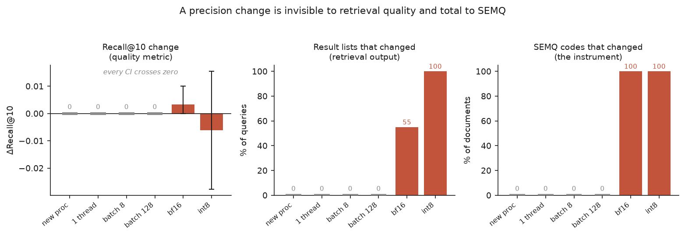
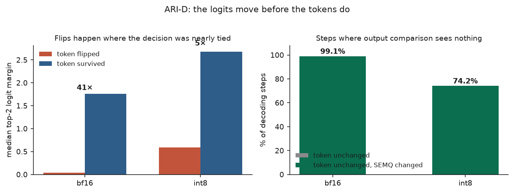
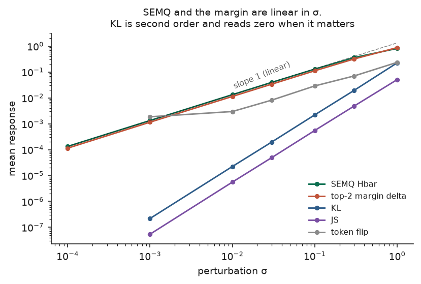
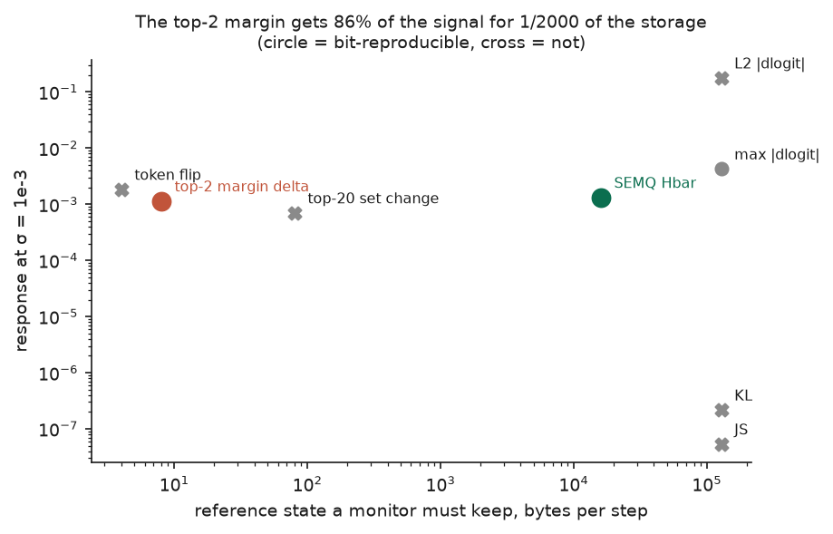
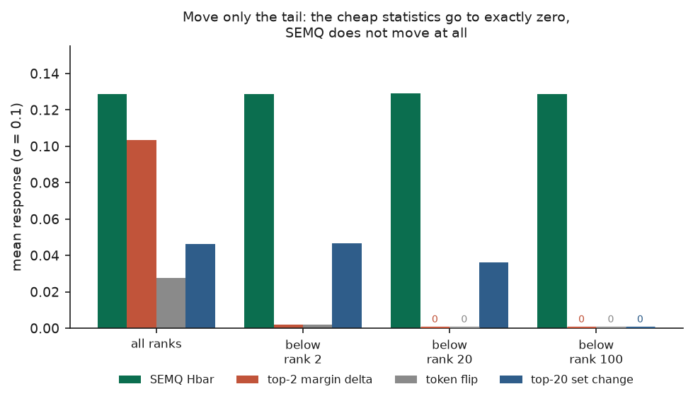
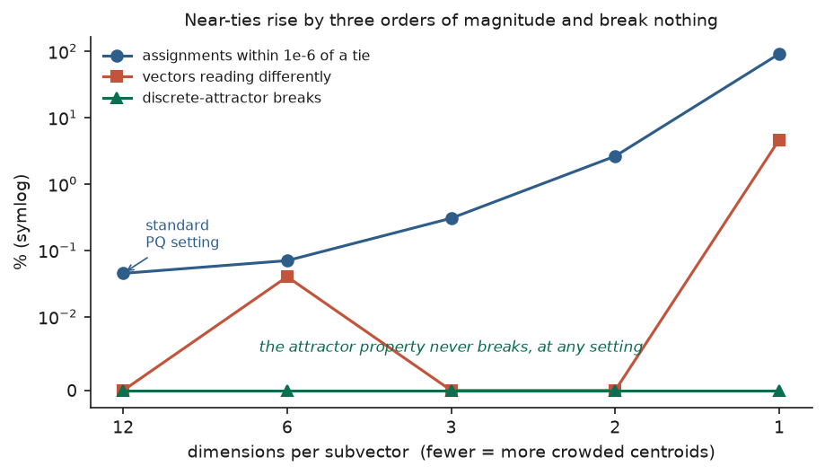

# Key results

Six measurements, in the order a reader should meet them. Two of the six go
against SEMQ. Those two are here because a result set that only supports the
product is not evidence.

Every figure reads the JSON that an experiment wrote. The script is
[`figures/make_figures.py`](figures/make_figures.py). No figure recomputes a
number, so no figure can disagree with the table it illustrates.

---

## 1. A serving change is invisible to retrieval quality

BEIR SciFact, 5,183 documents, 300 queries with real relevance judgements.
Every condition changes one thing about how the encoder runs.

A change to bf16 or int8 moves Recall@10 by an amount that a bootstrap cannot
tell apart from zero. The same change rewrites the top-10 result list for 55%
and 100% of queries, and changes every one of the 5,183 SEMQ codes.

The four grey bars are the control. A new process, one thread, and a 4x or 16x
batch change move nothing on any of the three panels. Without those bars the
red bars would prove nothing, because an instrument that fires at everything
detects nothing.

**Read this as: the metric teams put alarms on is the metric that cannot see a
precision change.** The endpoint returns 200. The dashboard stays flat.

---

## 2. At the decoding layer, the logits move before the tokens do

TinyLlama-1.1B, 12 prompts, 48 greedy tokens each, 539 decoding steps. Greedy
decoding removes sampling noise, so every difference comes from the
infrastructure.

Under bf16 the model emits the same token at 99.07% of steps. The SEMQ code
differs at 100% of steps. At 99.07% of steps a monitor that compares output
sees nothing while the instrument sees the change.

The left panel explains why. Tokens that flipped sat at a median top-2 logit
margin of 0.043. Tokens that survived sat at 1.757. Flips concentrate where the
decision was already almost a tie, while the distribution moved everywhere.
That is the mechanism, measured rather than asserted.

---

## 3. KL divergence is the wrong instrument for small changes

The obvious alternative to a symbolic code is KL divergence over the logprob
distribution. It fails, and the reason is structural rather than incidental.

KL is second order in the perturbation. A 10x rise in sigma gives a 100x rise
in KL. At sigma = 1e-4 it reads -5.1e-10, which is zero to numerical precision
and carries the wrong sign. SEMQ reads 1.33e-4 at the same point. Jensen-Shannon
divergence inherits the same defect.

SEMQ and the top-2 margin both track the dashed line, which has slope 1. They
are linear in sigma. That property is what an instrument needs near its noise
floor.

---

## 4. The result that goes against SEMQ

The top-2 margin sits at almost the same height as SEMQ and 2,000 positions to
the left. It gets 86% of the response for 8 bytes of stored reference state
instead of 16,000. Both are reproducible bit-exactly, so that axis does not
separate them either.

**For detecting a precision change, ship the margin statistic.** SEMQ does not
earn its cost on this axis, and a reviewer who runs this comparison will find
the same thing.

The crosses mark statistics that are not reproducible bit-exactly. Regrouping
the arithmetic moves KL by 4.6% and Jensen-Shannon by more than 100%. A
published KL value is not a number a third party can recompute. That matters
for attestation and not for detection.

---

## 5. What SEMQ does that the cheap statistics cannot

Figure 4 used isotropic noise, which moves the top of the distribution and the
tail together. That cannot separate a statistic which reads the whole vector
from one which reads two entries. This figure moves only the tail and leaves
the top ranks untouched by construction.

SEMQ does not move: 0.1289 against 0.1288 for the full perturbation. The top-2
margin and the token statistic read **exactly zero**. They are not less
sensitive. They cannot see the tail at all.

Whether that matters depends on a question this work has not answered. A
precision change is close to isotropic, and the margin catches it. A token
suppression filter, an adapter, or a tokenizer change need not be isotropic. A
provider that silently adds an output filter is the realistic case, and the
cheap tripwire cannot cover it.

**The defensible position is both, not either.** Keep the margin as an 8-byte
tripwire. Keep SEMQ for the coverage the tripwire lacks, and for attestation.

---

## 6. The second result that goes against SEMQ

Whitepaper section 3.1 argued twice that SEMQ is necessary for the index, and
this experiment retracted both arguments.

Crowding the centroids of a product quantizer does raise the near-tie rate, by
three orders of magnitude across the sweep. The blue line is real. The green
line is the point: `encode(reconstruct(c)) = c` holds at every setting, even at
91% near-tie density. The failure reported earlier needed a constructed
codebook with centroids placed 1e-6 apart, and k-means does not produce that
geometry.

Two centroids that close compete for the same Voronoi mass and merge.

**So SEMQ is not necessary for the index.** What remains is an argument about
verification cost. A SEMQ guarantee follows from the form of the operator and a
verifier can check it in advance. A vector-quantizer guarantee has to be
measured again for each codebook that ships.

---

## What is not measured yet

- **Every GPU condition.** TF32 on against off is the strongest remaining case,
  because a model audited at fp32 on a CPU and served at fp32 on a GPU changes
  with no signal to the caller. The apparatus is ready in [`../infra/`](../infra/README.md).
- **Whether real drift is tail-confined.** Figure 5 shows SEMQ *can* see what
  the margin cannot. It does not show that any real serving change produces
  that pattern. This decides whether the coverage argument is commercially real
  or only true.
- **ARI-E on real trajectories.** The metric and its tests exist. At 25 cases
  the bootstrap interval on cross-harness agreement runs from 0.44 to 0.80, so
  only a large harness effect will separate from zero.
- **Scale.** One encoder for the retrieval work, one 1.1B model for the decoding
  work, one corpus each.
